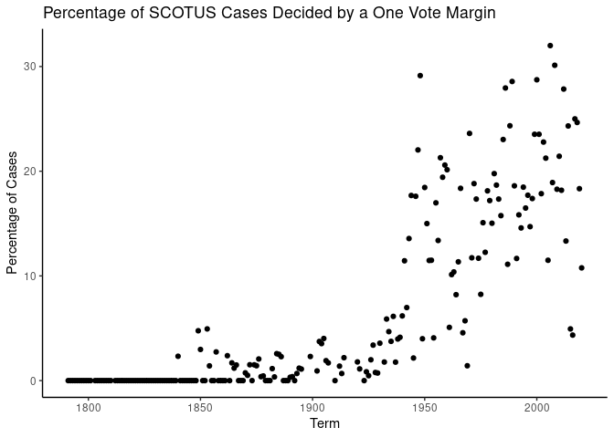
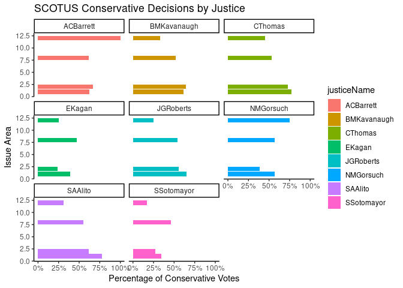
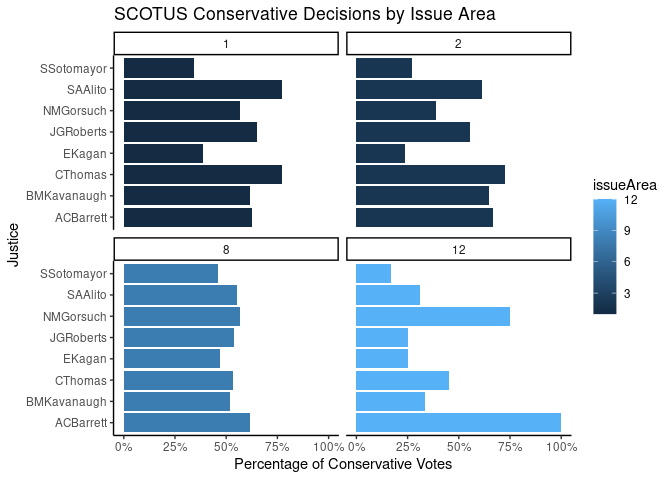
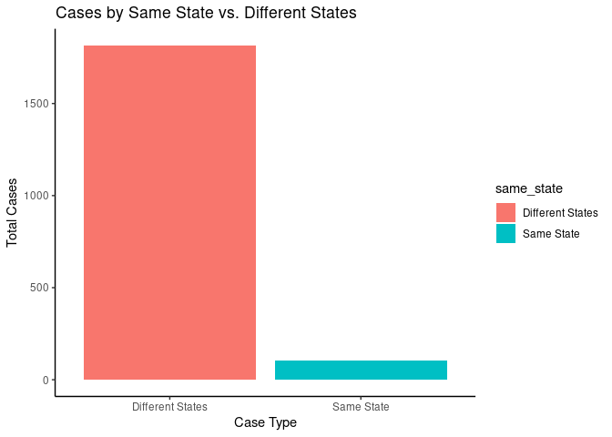

HW03: Data Wrangling and Analysis of U.S. Supreme Court Decisions
================
Sophie Ennis

## DATA

Before starting this homework, take some time to review the data
description posted on our website under HW3. Familiarize yourself with
each data source, the variables required for this assignment and their
codebook. Understanding the data beforehand will save you time during
the assignment and help prevent issues. Additionally, we encourage you
to review the rubric used to evaluate homework assignments (see the
website).

Load the libraries

``` r
library(tidyverse)
```

    ## ── Attaching packages ─────────────────────────────────────── tidyverse 1.3.2 ──
    ## ✔ ggplot2 3.4.0     ✔ purrr   1.0.2
    ## ✔ tibble  3.2.1     ✔ dplyr   1.1.4
    ## ✔ tidyr   1.3.0     ✔ stringr 1.5.1
    ## ✔ readr   2.1.5     ✔ forcats 0.5.2
    ## ── Conflicts ────────────────────────────────────────── tidyverse_conflicts() ──
    ## ✖ dplyr::filter() masks stats::filter()
    ## ✖ dplyr::lag()    masks stats::lag()

``` r
library(readr)
```

Load the data using `read_csv()` and a relative path (notice the two
data frames are located in the “data” folder). Label the imported data
as `scdb_case` and `scdb_vote`

``` r
scdb_case <- read_csv("data/scdb-case.csv")
```

    ## Rows: 28981 Columns: 52
    ## ── Column specification ────────────────────────────────────────────────────────
    ## Delimiter: ","
    ## chr (14): caseId, docketId, caseIssuesId, dateDecision, usCite, sctCite, led...
    ## dbl (38): decisionType, term, naturalCourt, petitioner, petitionerState, res...
    ## 
    ## ℹ Use `spec()` to retrieve the full column specification for this data.
    ## ℹ Specify the column types or set `show_col_types = FALSE` to quiet this message.

``` r
scdb_vote <- read_csv("data/scdb-vote.csv")
```

    ## Rows: 253643 Columns: 13
    ## ── Column specification ────────────────────────────────────────────────────────
    ## Delimiter: ","
    ## chr (5): caseId, docketId, caseIssuesId, voteId, justiceName
    ## dbl (8): term, justice, vote, opinion, direction, majority, firstAgreement, ...
    ## 
    ## ℹ Use `spec()` to retrieve the full column specification for this data.
    ## ℹ Specify the column types or set `show_col_types = FALSE` to quiet this message.

Explore the data using functions such as `head`, `summary`, `glimpse`,
etc. or any other suitable functions

``` r
glimpse(scdb_case)
```

    ## Rows: 28,981
    ## Columns: 52
    ## $ caseId                   <chr> "1791-001", "1791-002", "1792-001", "1792-002…
    ## $ docketId                 <chr> "1791-001-01", "1791-002-01", "1792-001-01", …
    ## $ caseIssuesId             <chr> "1791-001-01-01", "1791-002-01-01", "1792-001…
    ## $ dateDecision             <chr> "8/3/1791", "8/3/1791", "2/14/1792", "8/7/179…
    ## $ decisionType             <dbl> 6, 2, 2, 2, 8, 6, 8, 2, 8, NA, 1, 6, 8, 8, 6,…
    ## $ usCite                   <chr> "2 U.S. 401", "2 U.S. 401", "2 U.S. 401", "2 …
    ## $ sctCite                  <chr> NA, NA, NA, NA, NA, NA, NA, NA, NA, NA, NA, N…
    ## $ ledCite                  <chr> "1 L. Ed. 433", "1 L. Ed. 433", "1 L. Ed. 433…
    ## $ lexisCite                <chr> "1791 U.S. LEXIS 189", "1791 U.S. LEXIS 190",…
    ## $ term                     <dbl> 1791, 1791, 1792, 1792, 1792, 1792, 1793, 179…
    ## $ naturalCourt             <dbl> 102, 102, 102, 103, 103, 103, 103, 103, 103, …
    ## $ chief                    <chr> "Jay", "Jay", "Jay", "Jay", "Jay", "Jay", "Ja…
    ## $ docket                   <chr> NA, NA, NA, NA, NA, NA, NA, NA, NA, NA, NA, N…
    ## $ caseName                 <chr> "WEST, PLS. IN ERR. VERSUS BARNES. et al.", "…
    ## $ dateArgument             <chr> "8/2/1791", NA, NA, NA, "8/9/1792", "8/8/1792…
    ## $ dateRearg                <chr> NA, NA, NA, NA, NA, NA, NA, NA, NA, NA, NA, N…
    ## $ petitioner               <dbl> 501, 501, 102, 102, 28, 1, 238, 102, 135, 28,…
    ## $ petitionerState          <dbl> NA, NA, NA, NA, 13, NA, NA, NA, NA, 13, NA, N…
    ## $ respondent               <dbl> 111, 28, 28, 28, 195, 6, 28, 28, 28, 135, 116…
    ## $ respondentState          <dbl> NA, 25, 37, 37, NA, 45, 13, 37, 13, NA, NA, N…
    ## $ jurisdiction             <dbl> 13, 15, 15, 15, 7, 8, 9, 15, 7, 9, 2, 14, 13,…
    ## $ adminAction              <dbl> NA, NA, NA, NA, NA, NA, NA, NA, NA, NA, NA, N…
    ## $ adminActionState         <dbl> NA, NA, NA, NA, NA, NA, NA, NA, NA, NA, NA, N…
    ## $ threeJudgeFdc            <dbl> 0, 0, 0, 0, 0, 0, 0, 0, 0, 0, 0, 0, 0, 0, 0, …
    ## $ caseOrigin               <dbl> 431, NA, NA, NA, 409, 430, NA, NA, 409, NA, 7…
    ## $ caseOriginState          <dbl> NA, NA, NA, NA, NA, NA, NA, NA, NA, NA, NA, N…
    ## $ caseSource               <dbl> 431, NA, NA, NA, 409, 430, NA, NA, 409, NA, 4…
    ## $ caseSourceState          <dbl> NA, NA, NA, NA, NA, NA, NA, NA, NA, NA, NA, N…
    ## $ lcDisagreement           <dbl> 0, 0, 0, 0, 0, 0, 0, 0, 0, 0, 0, 0, 0, 0, 0, …
    ## $ certReason               <dbl> 1, 1, 1, 1, 1, 1, 1, 1, 1, 1, 1, 1, 1, 1, 1, …
    ## $ lcDisposition            <dbl> NA, 9, NA, NA, 1, 9, NA, NA, 9, NA, 2, NA, 3,…
    ## $ lcDispositionDirection   <dbl> 1, 1, 1, 1, 1, 2, NA, 1, 1, NA, 1, 1, 2, 1, 1…
    ## $ declarationUncon         <dbl> 1, 1, 1, 1, 1, 2, 1, 1, 1, 1, 1, 1, 1, 1, 1, …
    ## $ caseDisposition          <dbl> 9, 1, 9, 1, 11, 9, 1, 9, 1, 9, 4, 11, 2, 3, 9…
    ## $ caseDispositionUnusual   <dbl> 0, 0, 0, 0, 0, 0, 0, 0, 0, 0, 0, 0, 0, 0, 0, …
    ## $ partyWinning             <dbl> 0, 1, 0, 1, 1, 0, 1, 0, 1, 0, 1, 1, 0, 1, 0, …
    ## $ precedentAlteration      <dbl> 0, 0, 0, 0, 0, 0, 0, 0, 0, 0, 0, 0, 0, 0, 0, …
    ## $ voteUnclear              <dbl> 0, 0, 0, 0, 0, 0, 0, 0, 0, 0, 0, 0, 0, 0, 0, …
    ## $ issue                    <dbl> 90320, 90320, 90150, 90320, 90370, 90340, 100…
    ## $ issueArea                <dbl> 9, 9, 9, 9, 9, 9, 10, 9, 9, 4, 9, 1, 9, 9, 9,…
    ## $ decisionDirection        <dbl> 1, 2, 1, 2, 2, 2, 2, 1, 2, 1, 2, 2, 2, 2, 1, …
    ## $ decisionDirectionDissent <dbl> 0, 0, 0, 0, 0, 0, 0, 0, 0, 0, 0, 0, 0, 0, 0, …
    ## $ authorityDecision1       <dbl> 3, 3, 3, 3, 7, 4, 1, 3, 7, 4, 3, 7, 7, 3, 3, …
    ## $ authorityDecision2       <dbl> NA, NA, NA, NA, 4, 7, 3, NA, 4, 7, NA, 4, 4, …
    ## $ lawType                  <dbl> 4, 4, 6, 4, 6, 6, 1, 9, 6, 8, 9, 6, 6, 9, 6, …
    ## $ lawSupp                  <dbl> 403, 403, 600, 403, 600, 600, 140, 900, 600, …
    ## $ lawMinor                 <chr> "NULL", "NULL", NA, "NULL", NA, "imposition o…
    ## $ majOpinWriter            <dbl> NA, NA, NA, NA, NA, NA, NA, NA, NA, NA, 1, NA…
    ## $ majOpinAssigner          <dbl> 1, 1, 1, 1, 1, 1, 1, 1, 1, 8, 1, 1, 1, 4, 1, …
    ## $ splitVote                <dbl> 1, 1, 1, 1, 1, 1, 1, 1, 1, 1, 1, 1, 1, 1, 1, …
    ## $ majVotes                 <dbl> 5, 5, 6, 6, 4, 6, 4, 5, 4, 1, 6, 6, 3, 2, 6, …
    ## $ minVotes                 <dbl> 0, 0, 0, 0, 2, 0, 1, 0, 1, 0, 0, 0, 3, 2, 0, …

``` r
glimpse(scdb_vote)
```

    ## Rows: 253,643
    ## Columns: 13
    ## $ caseId          <chr> "1791-001", "1791-001", "1791-001", "1791-001", "1791-…
    ## $ docketId        <chr> "1791-001-01", "1791-001-01", "1791-001-01", "1791-001…
    ## $ caseIssuesId    <chr> "1791-001-01-01", "1791-001-01-01", "1791-001-01-01", …
    ## $ voteId          <chr> "1791-001-01-01-01-01", "1791-001-01-01-01-02", "1791-…
    ## $ term            <dbl> 1791, 1791, 1791, 1791, 1791, 1791, 1791, 1791, 1791, …
    ## $ justice         <dbl> 1, 3, 4, 5, 6, 1, 3, 4, 5, 6, 1, 3, 4, 5, 6, 7, 1, 3, …
    ## $ justiceName     <chr> "JJay", "WCushing", "JWilson", "JBlair", "JIredell", "…
    ## $ vote            <dbl> 1, 1, 1, 1, 1, 1, 1, 1, 1, 1, 1, 1, 1, 1, 1, 1, 1, 1, …
    ## $ opinion         <dbl> 1, 1, 1, 1, 1, 1, 1, 1, 1, 1, 1, 1, 1, 1, 1, 1, 1, 1, …
    ## $ direction       <dbl> 1, 1, 1, 1, 1, 2, 2, 2, 2, 2, 1, 1, 1, 1, 1, 1, 2, 2, …
    ## $ majority        <dbl> 2, 2, 2, 2, 2, 2, 2, 2, 2, 2, 2, 2, 2, 2, 2, 2, 2, 2, …
    ## $ firstAgreement  <dbl> NA, NA, NA, NA, NA, NA, NA, NA, NA, NA, NA, NA, NA, NA…
    ## $ secondAgreement <dbl> NA, NA, NA, NA, NA, NA, NA, NA, NA, NA, NA, NA, NA, NA…

``` r
head(scdb_case)
```

    ## # A tibble: 6 × 52
    ##   caseId  docketId caseIssuesId dateDecision decisionType usCite sctCite ledCite
    ##   <chr>   <chr>    <chr>        <chr>               <dbl> <chr>  <chr>   <chr>  
    ## 1 1791-0… 1791-00… 1791-001-01… 8/3/1791                6 2 U.S… <NA>    1 L. E…
    ## 2 1791-0… 1791-00… 1791-002-01… 8/3/1791                2 2 U.S… <NA>    1 L. E…
    ## 3 1792-0… 1792-00… 1792-001-01… 2/14/1792               2 2 U.S… <NA>    1 L. E…
    ## 4 1792-0… 1792-00… 1792-002-01… 8/7/1792                2 2 U.S… <NA>    1 L. E…
    ## 5 1792-0… 1792-00… 1792-003-01… 8/11/1792               8 2 U.S… <NA>    1 L. E…
    ## 6 1792-0… 1792-00… 1792-004-01… 8/11/1792               6 2 U.S… <NA>    1 L. E…
    ## # ℹ 44 more variables: lexisCite <chr>, term <dbl>, naturalCourt <dbl>,
    ## #   chief <chr>, docket <chr>, caseName <chr>, dateArgument <chr>,
    ## #   dateRearg <chr>, petitioner <dbl>, petitionerState <dbl>, respondent <dbl>,
    ## #   respondentState <dbl>, jurisdiction <dbl>, adminAction <dbl>,
    ## #   adminActionState <dbl>, threeJudgeFdc <dbl>, caseOrigin <dbl>,
    ## #   caseOriginState <dbl>, caseSource <dbl>, caseSourceState <dbl>,
    ## #   lcDisagreement <dbl>, certReason <dbl>, lcDisposition <dbl>, …

``` r
head(scdb_vote)
```

    ## # A tibble: 6 × 13
    ##   caseId   docketId  caseIssuesId voteId  term justice justiceName  vote opinion
    ##   <chr>    <chr>     <chr>        <chr>  <dbl>   <dbl> <chr>       <dbl>   <dbl>
    ## 1 1791-001 1791-001… 1791-001-01… 1791-…  1791       1 JJay            1       1
    ## 2 1791-001 1791-001… 1791-001-01… 1791-…  1791       3 WCushing        1       1
    ## 3 1791-001 1791-001… 1791-001-01… 1791-…  1791       4 JWilson         1       1
    ## 4 1791-001 1791-001… 1791-001-01… 1791-…  1791       5 JBlair          1       1
    ## 5 1791-001 1791-001… 1791-001-01… 1791-…  1791       6 JIredell        1       1
    ## 6 1791-002 1791-002… 1791-002-01… 1791-…  1791       1 JJay            1       1
    ## # ℹ 4 more variables: direction <dbl>, majority <dbl>, firstAgreement <dbl>,
    ## #   secondAgreement <dbl>

## TASK 1: RECODE VARIABLES

Drawing from the content we have learned so far in the course, recode
the following variables according to the instructions below. You will
use the newly generated variables (along with other variables from the
data) to answer the other parts of this assignment.

Important:

-   Pay attention to the data type: your recoded variable should have
    the same data type of the original variable, unless you are
    explicitly asked to modify the data type. For example, if the
    variable majority is a `dbl` (double), make sure that your recoded
    variable is also a `dbl`
-   For each variable that you recode, show the total observations for
    each value before and after recoding it

Variables to recode:

`decisionDirection`: this variable takes four values (1 conservative, 2
liberal, 3 unspecifiable, and NA); please verify this in the
[documentation](http://scdb.wustl.edu/documentation.php?var=decisionDirection#norms).
Recode this variable to take three values: 0, 1, NA (0 conservative, 1
liberal, and NA for both NA and unspecifiable)

``` r
scdb_case <- scdb_case %>% 
  mutate(decisionDirection_recode = case_when(
    decisionDirection == 1 ~ 0,
    decisionDirection == 2 ~ 1,
    decisionDirection == 3 ~ NA,
    is.na(decisionDirection) ~ NA))

print(scdb_case)
```

    ## # A tibble: 28,981 × 53
    ##    caseId docketId caseIssuesId dateDecision decisionType usCite sctCite ledCite
    ##    <chr>  <chr>    <chr>        <chr>               <dbl> <chr>  <chr>   <chr>  
    ##  1 1791-… 1791-00… 1791-001-01… 8/3/1791                6 2 U.S… <NA>    1 L. E…
    ##  2 1791-… 1791-00… 1791-002-01… 8/3/1791                2 2 U.S… <NA>    1 L. E…
    ##  3 1792-… 1792-00… 1792-001-01… 2/14/1792               2 2 U.S… <NA>    1 L. E…
    ##  4 1792-… 1792-00… 1792-002-01… 8/7/1792                2 2 U.S… <NA>    1 L. E…
    ##  5 1792-… 1792-00… 1792-003-01… 8/11/1792               8 2 U.S… <NA>    1 L. E…
    ##  6 1792-… 1792-00… 1792-004-01… 8/11/1792               6 2 U.S… <NA>    1 L. E…
    ##  7 1793-… 1793-00… 1793-001-01… 2/19/1793               8 2 U.S… <NA>    1 L. E…
    ##  8 1793-… 1793-00… 1793-002-01… 2/20/1793               2 2 U.S… <NA>    1 L. E…
    ##  9 1793-… 1793-00… 1793-003-01… 2/20/1793               8 2 U.S… <NA>    1 L. E…
    ## 10 1794-… 1794-00… 1794-001-01… 2/7/1794               NA 3 U.S… <NA>    1 L. E…
    ## # ℹ 28,971 more rows
    ## # ℹ 45 more variables: lexisCite <chr>, term <dbl>, naturalCourt <dbl>,
    ## #   chief <chr>, docket <chr>, caseName <chr>, dateArgument <chr>,
    ## #   dateRearg <chr>, petitioner <dbl>, petitionerState <dbl>, respondent <dbl>,
    ## #   respondentState <dbl>, jurisdiction <dbl>, adminAction <dbl>,
    ## #   adminActionState <dbl>, threeJudgeFdc <dbl>, caseOrigin <dbl>,
    ## #   caseOriginState <dbl>, caseSource <dbl>, caseSourceState <dbl>, …

``` r
before_recode_dD <- scdb_case %>%
  count(decisionDirection, name = "total_observations_before")
after_recode_dD <- scdb_case %>%
  count(decisionDirection_recode, name = "total_observations_after")
comparison_dD <- left_join(before_recode_dD, after_recode_dD, 
                        by = c("decisionDirection" = "decisionDirection_recode"))
comparison_dD
```

    ## # A tibble: 4 × 3
    ##   decisionDirection total_observations_before total_observations_after
    ##               <dbl>                     <int>                    <int>
    ## 1                 1                     11971                    13060
    ## 2                 2                     13060                       NA
    ## 3                 3                      3831                       NA
    ## 4                NA                       119                     3950

`majority`: this variable takes two values (1 dissent, 2 majority; see
[documentation](http://scdb.wustl.edu/documentation.php?var=majority).
Recode it so dissent becomes 0 and majority becomes 1; leave the missing
data unchanged

``` r
scdb_vote <- scdb_vote %>% 
  mutate(majority_recode = case_when(
    majority == 1 ~ 0,
    majority == 2 ~ 1))
print(scdb_vote)
```

    ## # A tibble: 253,643 × 14
    ##    caseId   docketId caseIssuesId voteId  term justice justiceName  vote opinion
    ##    <chr>    <chr>    <chr>        <chr>  <dbl>   <dbl> <chr>       <dbl>   <dbl>
    ##  1 1791-001 1791-00… 1791-001-01… 1791-…  1791       1 JJay            1       1
    ##  2 1791-001 1791-00… 1791-001-01… 1791-…  1791       3 WCushing        1       1
    ##  3 1791-001 1791-00… 1791-001-01… 1791-…  1791       4 JWilson         1       1
    ##  4 1791-001 1791-00… 1791-001-01… 1791-…  1791       5 JBlair          1       1
    ##  5 1791-001 1791-00… 1791-001-01… 1791-…  1791       6 JIredell        1       1
    ##  6 1791-002 1791-00… 1791-002-01… 1791-…  1791       1 JJay            1       1
    ##  7 1791-002 1791-00… 1791-002-01… 1791-…  1791       3 WCushing        1       1
    ##  8 1791-002 1791-00… 1791-002-01… 1791-…  1791       4 JWilson         1       1
    ##  9 1791-002 1791-00… 1791-002-01… 1791-…  1791       5 JBlair          1       1
    ## 10 1791-002 1791-00… 1791-002-01… 1791-…  1791       6 JIredell        1       1
    ## # ℹ 253,633 more rows
    ## # ℹ 5 more variables: direction <dbl>, majority <dbl>, firstAgreement <dbl>,
    ## #   secondAgreement <dbl>, majority_recode <dbl>

``` r
before_recode_m <- scdb_vote %>%
  count(majority, name = "total_observations_before")
after_recode_m <- scdb_vote %>%
  count(majority_recode, name = "total_observations_after")
comparison_m <- left_join(before_recode_m, after_recode_m, 
                        by = c("majority" = "majority_recode"))
comparison_m
```

    ## # A tibble: 3 × 3
    ##   majority total_observations_before total_observations_after
    ##      <dbl>                     <int>                    <int>
    ## 1        1                     20464                   222833
    ## 2        2                    222833                       NA
    ## 3       NA                     10346                    10346

`direction`: this variable takes two values (1 conservative, 2 liberal);
see the
[documentation](http://scdb.wustl.edu/documentation.php?var=direction).
Recode it so conservative becomes 0 and liberal becomes 1; leave the
missing data unchanged

``` r
scdb_vote <- scdb_vote %>% 
  mutate(direction_recode = case_when(
    direction == 1 ~ 0,
    direction == 2 ~ 1))
print(scdb_vote)
```

    ## # A tibble: 253,643 × 15
    ##    caseId   docketId caseIssuesId voteId  term justice justiceName  vote opinion
    ##    <chr>    <chr>    <chr>        <chr>  <dbl>   <dbl> <chr>       <dbl>   <dbl>
    ##  1 1791-001 1791-00… 1791-001-01… 1791-…  1791       1 JJay            1       1
    ##  2 1791-001 1791-00… 1791-001-01… 1791-…  1791       3 WCushing        1       1
    ##  3 1791-001 1791-00… 1791-001-01… 1791-…  1791       4 JWilson         1       1
    ##  4 1791-001 1791-00… 1791-001-01… 1791-…  1791       5 JBlair          1       1
    ##  5 1791-001 1791-00… 1791-001-01… 1791-…  1791       6 JIredell        1       1
    ##  6 1791-002 1791-00… 1791-002-01… 1791-…  1791       1 JJay            1       1
    ##  7 1791-002 1791-00… 1791-002-01… 1791-…  1791       3 WCushing        1       1
    ##  8 1791-002 1791-00… 1791-002-01… 1791-…  1791       4 JWilson         1       1
    ##  9 1791-002 1791-00… 1791-002-01… 1791-…  1791       5 JBlair          1       1
    ## 10 1791-002 1791-00… 1791-002-01… 1791-…  1791       6 JIredell        1       1
    ## # ℹ 253,633 more rows
    ## # ℹ 6 more variables: direction <dbl>, majority <dbl>, firstAgreement <dbl>,
    ## #   secondAgreement <dbl>, majority_recode <dbl>, direction_recode <dbl>

``` r
before_recode_d <- scdb_vote %>%
  count(direction, name = "total_observations_before")
after_recode_d <- scdb_vote %>%
  count(direction_recode, name = "total_observations_after")
comparison_d <- left_join(before_recode_d, after_recode_d, 
                        by = c("direction" = "direction_recode"))
comparison_d
```

    ## # A tibble: 3 × 3
    ##   direction total_observations_before total_observations_after
    ##       <dbl>                     <int>                    <int>
    ## 1         1                    100577                   110648
    ## 2         2                    110648                       NA
    ## 3        NA                     42418                    42418

`chief`: convert this variable to a factor; check the original order of
the levels of this variable (they should be Jay, Routlege, Ellsworth,
etc.) and make sure your new factor variable has the same order

``` r
chief_levels <- c("Jay", "Rutledge", "Ellsworth", "Marshall", "Taney", 
                  "Chase", "Waite", "Fuller", "White", "Taft", "Hughes", 
                  "Stone", "Vinson", "Warren", "Burger", "Rehnquist", 
                  "Roberts")
class(chief_levels)
```

    ## [1] "character"

``` r
scdb_case <- 
  scdb_case %>% 
  mutate(chief_factor = factor(chief, levels = chief_levels))
print(scdb_case)
```

    ## # A tibble: 28,981 × 54
    ##    caseId docketId caseIssuesId dateDecision decisionType usCite sctCite ledCite
    ##    <chr>  <chr>    <chr>        <chr>               <dbl> <chr>  <chr>   <chr>  
    ##  1 1791-… 1791-00… 1791-001-01… 8/3/1791                6 2 U.S… <NA>    1 L. E…
    ##  2 1791-… 1791-00… 1791-002-01… 8/3/1791                2 2 U.S… <NA>    1 L. E…
    ##  3 1792-… 1792-00… 1792-001-01… 2/14/1792               2 2 U.S… <NA>    1 L. E…
    ##  4 1792-… 1792-00… 1792-002-01… 8/7/1792                2 2 U.S… <NA>    1 L. E…
    ##  5 1792-… 1792-00… 1792-003-01… 8/11/1792               8 2 U.S… <NA>    1 L. E…
    ##  6 1792-… 1792-00… 1792-004-01… 8/11/1792               6 2 U.S… <NA>    1 L. E…
    ##  7 1793-… 1793-00… 1793-001-01… 2/19/1793               8 2 U.S… <NA>    1 L. E…
    ##  8 1793-… 1793-00… 1793-002-01… 2/20/1793               2 2 U.S… <NA>    1 L. E…
    ##  9 1793-… 1793-00… 1793-003-01… 2/20/1793               8 2 U.S… <NA>    1 L. E…
    ## 10 1794-… 1794-00… 1794-001-01… 2/7/1794               NA 3 U.S… <NA>    1 L. E…
    ## # ℹ 28,971 more rows
    ## # ℹ 46 more variables: lexisCite <chr>, term <dbl>, naturalCourt <dbl>,
    ## #   chief <chr>, docket <chr>, caseName <chr>, dateArgument <chr>,
    ## #   dateRearg <chr>, petitioner <dbl>, petitionerState <dbl>, respondent <dbl>,
    ## #   respondentState <dbl>, jurisdiction <dbl>, adminAction <dbl>,
    ## #   adminActionState <dbl>, threeJudgeFdc <dbl>, caseOrigin <dbl>,
    ## #   caseOriginState <dbl>, caseSource <dbl>, caseSourceState <dbl>, …

``` r
before_recode_c <- scdb_case %>%
  count(chief, name = "total_observations_before")
after_recode_c <- scdb_case %>%
  count(chief_factor, name = "total_observations_after")
comparison_c <- left_join(before_recode_c, after_recode_c, 
                        by = c("chief" = "chief_factor"))
comparison_c
```

    ## # A tibble: 17 × 3
    ##    chief     total_observations_before total_observations_after
    ##    <chr>                         <int>                    <int>
    ##  1 Burger                         2809                     2809
    ##  2 Chase                          1371                     1371
    ##  3 Ellsworth                        43                       43
    ##  4 Fuller                         5003                     5003
    ##  5 Hughes                         1896                     1896
    ##  6 Jay                              15                       15
    ##  7 Marshall                       1280                     1280
    ##  8 Rehnquist                      2044                     2044
    ##  9 Roberts                        1225                     1225
    ## 10 Rutledge                          5                        5
    ## 11 Stone                           781                      781
    ## 12 Taft                           1619                     1619
    ## 13 Taney                          1670                     1670
    ## 14 Vinson                          812                      812
    ## 15 Waite                          3650                     3650
    ## 16 Warren                         2205                     2205
    ## 17 White                          2553                     2553

`justiceName`: convert this variable to a factor; your new factor
variable should be in chronological order, meaning from the oldest to
the newest judge in terms of time served in the Supreme Court; this
order should be the same as in
[`justice`](http://scdb.wustl.edu/documentation.php?var=justice)

``` r
scdb_vote %>% distinct(justiceName) %>% pull(justiceName)
```

    ##   [1] "JJay"         "WCushing"     "JWilson"      "JBlair"       "JIredell"    
    ##   [6] "TJohnson"     "WPaterson"    "JRutledge2"   "SChase"       "OEllsworth"  
    ##  [11] "BWashington"  "AMoore"       "JMarshall"    "WJohnson"     "HBLivingston"
    ##  [16] "TTodd"        "GDuvall"      "JStory"       "SThompson"    "RTrimble"    
    ##  [21] "JMcLean"      "HBaldwin"     "JMWayne"      "RBTaney"      "PPBarbour"   
    ##  [26] "JCatron"      "JMcKinley"    "PVDaniel"     "SNelson"      "LWoodbury"   
    ##  [31] "RCGrier"      "BRCurtis"     "JACampbell"   "NClifford"    "NHSwayne"    
    ##  [36] "SFMiller"     "DDavis"       "SJField"      "SPChase"      "WStrong"     
    ##  [41] "JPBradley"    "WHunt"        "MRWaite"      "JHarlan1"     "WBWoods"     
    ##  [46] "SMatthews"    "HGray"        "SBlatchford"  "LQLamar"      "MWFuller"    
    ##  [51] "DJBrewer"     "HBBrown"      "GShiras"      "HEJackson"    "EDEWhite"    
    ##  [56] "RWPeckham"    "JMcKenna"     "OWHolmes"     "WRDay"        "WHMoody"     
    ##  [61] "HHLurton"     "CEHughes1"    "WVanDevanter" "JRLamar"      "MPitney"     
    ##  [66] "JCMcReynolds" "LDBrandeis"   "JHClarke"     "WHTaft"       "GSutherland" 
    ##  [71] "PButler"      "ETSanford"    "HFStone"      "CEHughes2"    "OJRoberts"   
    ##  [76] "BNCardozo"    "HLBlack"      "SFReed"       "FFrankfurter" "WODouglas"   
    ##  [81] "FMurphy"      "JFByrnes"     "RHJackson"    "WBRutledge"   "HHBurton"    
    ##  [86] "-99"          "FMVinson"     "TCClark"      "SMinton"      "EWarren"     
    ##  [91] "JHarlan2"     "WJBrennan"    "CEWhittaker"  "PStewart"     "BRWhite"     
    ##  [96] "AJGoldberg"   "AFortas"      "TMarshall"    "WEBurger"     "HABlackmun"  
    ## [101] "LFPowell"     "WHRehnquist"  "JPStevens"    "SDOConnor"    "AScalia"     
    ## [106] "AMKennedy"    "DHSouter"     "CThomas"      "RBGinsburg"   "SGBreyer"    
    ## [111] "JGRoberts"    "SAAlito"      "SSotomayor"   "EKagan"       "NMGorsuch"   
    ## [116] "BMKavanaugh"  "ACBarrett"

``` r
scdb_vote %>% distinct(justice) %>% print(n = 117)
```

    ## # A tibble: 117 × 1
    ##     justice
    ##       <dbl>
    ##   1       1
    ##   2       3
    ##   3       4
    ##   4       5
    ##   5       6
    ##   6       7
    ##   7       8
    ##   8       9
    ##   9      10
    ##  10      11
    ##  11      12
    ##  12      13
    ##  13      14
    ##  14      15
    ##  15      16
    ##  16      17
    ##  17      18
    ##  18      19
    ##  19      20
    ##  20      21
    ##  21      22
    ##  22      23
    ##  23      24
    ##  24      25
    ##  25      26
    ##  26      27
    ##  27      28
    ##  28      29
    ##  29      30
    ##  30      31
    ##  31      32
    ##  32      33
    ##  33      34
    ##  34      35
    ##  35      36
    ##  36      37
    ##  37      38
    ##  38      39
    ##  39      40
    ##  40      41
    ##  41      42
    ##  42      43
    ##  43      44
    ##  44      45
    ##  45      46
    ##  46      47
    ##  47      48
    ##  48      49
    ##  49      50
    ##  50      51
    ##  51      52
    ##  52      53
    ##  53      54
    ##  54      55
    ##  55      56
    ##  56      57
    ##  57      58
    ##  58      59
    ##  59      60
    ##  60      61
    ##  61      62
    ##  62      63
    ##  63      64
    ##  64      65
    ##  65      66
    ##  66      67
    ##  67      68
    ##  68      69
    ##  69      70
    ##  70      71
    ##  71      72
    ##  72      73
    ##  73      74
    ##  74      75
    ##  75      76
    ##  76      77
    ##  77      78
    ##  78      79
    ##  79      80
    ##  80      81
    ##  81      82
    ##  82      83
    ##  83      84
    ##  84      85
    ##  85      86
    ##  86     -99
    ##  87      87
    ##  88      88
    ##  89      89
    ##  90      90
    ##  91      91
    ##  92      92
    ##  93      93
    ##  94      94
    ##  95      95
    ##  96      96
    ##  97      97
    ##  98      98
    ##  99      99
    ## 100     100
    ## 101     101
    ## 102     102
    ## 103     103
    ## 104     104
    ## 105     105
    ## 106     106
    ## 107     107
    ## 108     108
    ## 109     109
    ## 110     110
    ## 111     111
    ## 112     112
    ## 113     113
    ## 114     114
    ## 115     115
    ## 116     116
    ## 117     117

``` r
justiceName_levels <- c("JJay", "WCushing", "JWilson", "JBlair", "JIredell", 
                        "TJohnson", "WPaterson", "JRutledge2", "SChase", 
                        "OEllsworth", "BWashington", "AMoore", "JMarshall", 
                        "WJohnson", "HBLivingston", "TTodd", "GDuvall", "JStory", 
                        "SThompson", "RTrimble", "JMcLean", "HBaldwin", "JMWayne", 
                        "RBTaney", "PPBarbour", "JCatron", "JMcKinley", "PVDaniel", 
                        "SNelson", "LWoodbury", "RCGrier", "BRCurtis", "JACampbell", 
                        "NClifford", "NHSwayne", "SFMiller", "DDavis", "SJField", 
                        "SPChase", "WStrong", "JPBradley", "WHunt", "MRWaite", 
                        "JHarlan1", "WBWoods", "SMatthews", "HGray", "SBlatchford",
                        "LQLamar", "MWFuller", "DJBrewer", "HBBrown", "GShiras", 
                        "HEJackson", "EDEWhite", "RWPeckham", "JMcKenna", "OWHolmes", 
                        "WRDay", "WHMoody", "HHLurton", "CEHughes1", "WVanDevanter", 
                        "JRLamar", "MPitney", "JCMcReynolds", "LDBrandeis", "JHClarke", 
                        "WHTaft", "GSutherland", "PButler", "ETSanford", "HFStone", 
                        "CEHughes2", "OJRoberts", "BNCardozo", "HLBlack", "SFReed",
                        "FFrankfurter", "WODouglas", "FMurphy", "JFByrnes", "RHJackson",
                        "WBRutledge", "HHBurton", "FMVinson", "TCClark", "SMinton", 
                        "EWarren", "JHarlan2", "WJBrennan", "CEWhittaker", "PStewart", 
                        "BRWhite", "AJGoldberg", "AFortas", "TMarshall", "WEBurger",
                        "HABlackmun", "LFPowell", "WHRehnquist", "JPStevens", "SDOConnor",
                        "AScalia", "AMKennedy", "DHSouter", "CThomas", "RBGinsburg", 
                        "SGBreyer", "JGRoberts", "SAAlito", "SSotomayor", "EKagan", 
                        "NMGorsuch", "BMKavanaugh", "ACBarrett")
scdb_vote <- scdb_vote %>% 
  arrange(justice) %>% 
  mutate(justiceName_factor = factor(justiceName, levels = justiceName_levels))
print(scdb_vote)
```

    ## # A tibble: 253,643 × 16
    ##    caseId   docketId caseIssuesId voteId  term justice justiceName  vote opinion
    ##    <chr>    <chr>    <chr>        <chr>  <dbl>   <dbl> <chr>       <dbl>   <dbl>
    ##  1 1918-233 1918-23… 1918-233-01… NULL    1918     -99 -99            NA      NA
    ##  2 1931-152 1931-15… 1931-152-01… NULL    1931     -99 -99            NA      NA
    ##  3 1915-245 1915-24… 1915-245-01… NULL    1915     -99 -99            NA      NA
    ##  4 1908-203 1908-20… 1908-203-01… NULL    1908     -99 -99            NA      NA
    ##  5 1898-184 1898-18… 1898-184-01… NULL    1898     -99 -99            NA      NA
    ##  6 1896-274 1896-27… 1896-274-01… NULL    1896     -99 -99            NA      NA
    ##  7 1922-231 1922-23… 1922-231-01… NULL    1922     -99 -99            NA      NA
    ##  8 1898-187 1898-18… 1898-187-01… NULL    1898     -99 -99            NA      NA
    ##  9 1901-204 1901-20… 1901-204-01… NULL    1901     -99 -99            NA      NA
    ## 10 1898-189 1898-18… 1898-189-01… NULL    1898     -99 -99            NA      NA
    ## # ℹ 253,633 more rows
    ## # ℹ 7 more variables: direction <dbl>, majority <dbl>, firstAgreement <dbl>,
    ## #   secondAgreement <dbl>, majority_recode <dbl>, direction_recode <dbl>,
    ## #   justiceName_factor <fct>

``` r
before_recode_jN <- scdb_vote %>%
  count(justiceName, name = "total_observations_before")
after_recode_jN <- scdb_vote %>%
  count(justiceName_factor, name = "total_observations_after")
comparison_jN <- left_join(before_recode_jN, after_recode_jN, 
                        by = c("justiceName" = "justiceName_factor"))
comparison_jN
```

    ## # A tibble: 117 × 3
    ##    justiceName total_observations_before total_observations_after
    ##    <chr>                           <int>                    <int>
    ##  1 -99                                25                       NA
    ##  2 ACBarrett                          65                       65
    ##  3 AFortas                           581                      581
    ##  4 AJGoldberg                        475                      475
    ##  5 AMKennedy                        2883                     2883
    ##  6 AMoore                             29                       29
    ##  7 AScalia                          2861                     2861
    ##  8 BMKavanaugh                       198                      198
    ##  9 BNCardozo                        1084                     1084
    ## 10 BRCurtis                          465                      465
    ## # ℹ 107 more rows

## TASK 2: ANSWER SPECIFIC QUESTIONS

The goal of this second task is to further explore the data and review
fundamental `dplyr` commands. Each question in this task should be
answered with just a few lines of code. Consult the
[documentation](http://scdb.wustl.edu/documentation.php?s=1) to
understand the meanings of the variables that you need to use.

Task 2 Question 1. Calculate the average number of minority (dissenting)
votes cast per term using the appropriate variables (inspect the
documentation to identify them). Exclude any missing values from your
calculation using methods learned in the course. Provide a few sentences
to explain the results (e.g., what does an average of 0.1 mean for a
given year? what is the highest and lowest and what do they mean? etc.)

``` r
dissent_per_term <- scdb_case %>% 
  group_by(term) %>% 
  summarize(avg_dissent = mean(minVotes, na.rm = TRUE))
print(dissent_per_term)
```

    ## # A tibble: 228 × 2
    ##     term avg_dissent
    ##    <dbl>       <dbl>
    ##  1  1791      0     
    ##  2  1792      0.5   
    ##  3  1793      0.667 
    ##  4  1794      0     
    ##  5  1795      0.833 
    ##  6  1796      0.0625
    ##  7  1797      0     
    ##  8  1798      0.167 
    ##  9  1799      0     
    ## 10  1800      0     
    ## # ℹ 218 more rows

``` r
summary(dissent_per_term)
```

    ##       term       avg_dissent    
    ##  Min.   :1791   Min.   :0.0000  
    ##  1st Qu.:1850   1st Qu.:0.1719  
    ##  Median :1906   Median :0.3921  
    ##  Mean   :1906   Mean   :0.7230  
    ##  3rd Qu.:1963   3rd Qu.:1.4223  
    ##  Max.   :2020   Max.   :2.1575

An average of 0.1 for a given term means that the justices were largely
in agreement during this term and most of the time did not dissent. The
lowest average minority votes is 0.00, and the highest average is 2.15.
This means that the highest number of dissenting votes that has ever
been recorded is on average two votes per term, and the lowest is an
average of zero dissenting votes per term. This means that the justices
are often in agreement on their rulings.

Task 2 Question 2. Is chief Justice Earl Warren a conservative or
liberal justice? To answer this question, compare how many times this
justice voted in either direction. Use the the appropriate variables
among those you recoded (check the documentation for details). Provide a
few sentences to explain the results.

``` r
combined_scdb <- scdb_case %>% 
  inner_join(scdb_vote, by = "caseId")

chief_warren <- combined_scdb %>% 
  filter(chief_factor == "Warren") %>% 
  group_by(direction_recode) %>% 
  summarize(vote_count = n())

print(chief_warren)
```

    ## # A tibble: 3 × 2
    ##   direction_recode vote_count
    ##              <dbl>      <int>
    ## 1                0       6757
    ## 2                1      11823
    ## 3               NA       1156

I recoded the variable direction so that conservative became 0 and
liberal became 1. This tibble therefore shows that Chief Warren was a
liberal justice, voting nearly twice as much liberally than he did
conservatively.

Task 2 Question 3. Formulate a question of similar complexity to the
preceding two questions and answer it using `dplyr`. The goal of this
question is for you to explore the data as you prefer and reinforce your
knowledge of fundamental `dplyr` verbs.

Which justice has voted the most conservatively?

``` r
most_conservative <- combined_scdb %>% 
  group_by(justiceName_factor) %>% 
  summarize(conservative_count = 
              sum(direction_recode == 0, 
                  na.rm = TRUE)) %>% 
  arrange(desc(conservative_count))
print(most_conservative)
```

    ## # A tibble: 117 × 2
    ##    justiceName_factor conservative_count
    ##    <fct>                           <int>
    ##  1 WHRehnquist                      3010
    ##  2 JHarlan1                         2973
    ##  3 SJField                          2705
    ##  4 EDEWhite                         2603
    ##  5 OWHolmes                         2603
    ##  6 JMcKenna                         2487
    ##  7 BRWhite                          2406
    ##  8 WVanDevanter                     2390
    ##  9 JCMcReynolds                     2182
    ## 10 MWFuller                         2005
    ## # ℹ 107 more rows

William Rehnquist has voted the most conservatively, voting 3,010 times
conservatively. John Rutledge (#2) voted the least conservatively, with
only 2 votes cast for conservative decisions.

## TASK 3: ANSWER OPEN-ENDED QUESTIONS

This final task builds on the previous two tasks. It simulates scenarios
you might encounter in real research settings, requiring more lines of
code to solve (e.g., remember to break down problems into simpler
steps!) and a deeper understanding of the data, as well as of `dplyr`
and `ggplot2`.

You can consult the `demo` folder in your repo for example plots. While
we won’t accept solutions that replicate ours exactly, you may use them
as a reference for your own work.

For each question, show graph(s) and provide 1-2 paragraphs of written
interpretation of your results. The interpretation should be both
descriptive (e.g., explaining what the graph depicts) and substantive
(what do the results show, and your analysis and conclusions by
observing the graph). Please add your written paragraphs as text (not as
a R comments), and place them after the code and results.

Task 3 Question 1. What percentage of cases in each term are decided by
a one-vote margin (i.e. 5-4, 4-3, etc.)? Show a graph with your results
and interpret them.

In addition to the code with the complete solution and your
interpretation of it, your submission should include the following two
elements: code that shows your initial exploration of the variables
needed to answer this question (e.g., if you need a categorical
variable, use the most appropriate `dplyr` function(s) to display that
variable categories and their counts, etc.); a brief explanation (as a
text) of your logic/approach for calculating the percentage or
proportion of cases in each term that are decided by a one-vote margin.

``` r
glimpse(scdb_case)
```

    ## Rows: 28,981
    ## Columns: 54
    ## $ caseId                   <chr> "1791-001", "1791-002", "1792-001", "1792-002…
    ## $ docketId                 <chr> "1791-001-01", "1791-002-01", "1792-001-01", …
    ## $ caseIssuesId             <chr> "1791-001-01-01", "1791-002-01-01", "1792-001…
    ## $ dateDecision             <chr> "8/3/1791", "8/3/1791", "2/14/1792", "8/7/179…
    ## $ decisionType             <dbl> 6, 2, 2, 2, 8, 6, 8, 2, 8, NA, 1, 6, 8, 8, 6,…
    ## $ usCite                   <chr> "2 U.S. 401", "2 U.S. 401", "2 U.S. 401", "2 …
    ## $ sctCite                  <chr> NA, NA, NA, NA, NA, NA, NA, NA, NA, NA, NA, N…
    ## $ ledCite                  <chr> "1 L. Ed. 433", "1 L. Ed. 433", "1 L. Ed. 433…
    ## $ lexisCite                <chr> "1791 U.S. LEXIS 189", "1791 U.S. LEXIS 190",…
    ## $ term                     <dbl> 1791, 1791, 1792, 1792, 1792, 1792, 1793, 179…
    ## $ naturalCourt             <dbl> 102, 102, 102, 103, 103, 103, 103, 103, 103, …
    ## $ chief                    <chr> "Jay", "Jay", "Jay", "Jay", "Jay", "Jay", "Ja…
    ## $ docket                   <chr> NA, NA, NA, NA, NA, NA, NA, NA, NA, NA, NA, N…
    ## $ caseName                 <chr> "WEST, PLS. IN ERR. VERSUS BARNES. et al.", "…
    ## $ dateArgument             <chr> "8/2/1791", NA, NA, NA, "8/9/1792", "8/8/1792…
    ## $ dateRearg                <chr> NA, NA, NA, NA, NA, NA, NA, NA, NA, NA, NA, N…
    ## $ petitioner               <dbl> 501, 501, 102, 102, 28, 1, 238, 102, 135, 28,…
    ## $ petitionerState          <dbl> NA, NA, NA, NA, 13, NA, NA, NA, NA, 13, NA, N…
    ## $ respondent               <dbl> 111, 28, 28, 28, 195, 6, 28, 28, 28, 135, 116…
    ## $ respondentState          <dbl> NA, 25, 37, 37, NA, 45, 13, 37, 13, NA, NA, N…
    ## $ jurisdiction             <dbl> 13, 15, 15, 15, 7, 8, 9, 15, 7, 9, 2, 14, 13,…
    ## $ adminAction              <dbl> NA, NA, NA, NA, NA, NA, NA, NA, NA, NA, NA, N…
    ## $ adminActionState         <dbl> NA, NA, NA, NA, NA, NA, NA, NA, NA, NA, NA, N…
    ## $ threeJudgeFdc            <dbl> 0, 0, 0, 0, 0, 0, 0, 0, 0, 0, 0, 0, 0, 0, 0, …
    ## $ caseOrigin               <dbl> 431, NA, NA, NA, 409, 430, NA, NA, 409, NA, 7…
    ## $ caseOriginState          <dbl> NA, NA, NA, NA, NA, NA, NA, NA, NA, NA, NA, N…
    ## $ caseSource               <dbl> 431, NA, NA, NA, 409, 430, NA, NA, 409, NA, 4…
    ## $ caseSourceState          <dbl> NA, NA, NA, NA, NA, NA, NA, NA, NA, NA, NA, N…
    ## $ lcDisagreement           <dbl> 0, 0, 0, 0, 0, 0, 0, 0, 0, 0, 0, 0, 0, 0, 0, …
    ## $ certReason               <dbl> 1, 1, 1, 1, 1, 1, 1, 1, 1, 1, 1, 1, 1, 1, 1, …
    ## $ lcDisposition            <dbl> NA, 9, NA, NA, 1, 9, NA, NA, 9, NA, 2, NA, 3,…
    ## $ lcDispositionDirection   <dbl> 1, 1, 1, 1, 1, 2, NA, 1, 1, NA, 1, 1, 2, 1, 1…
    ## $ declarationUncon         <dbl> 1, 1, 1, 1, 1, 2, 1, 1, 1, 1, 1, 1, 1, 1, 1, …
    ## $ caseDisposition          <dbl> 9, 1, 9, 1, 11, 9, 1, 9, 1, 9, 4, 11, 2, 3, 9…
    ## $ caseDispositionUnusual   <dbl> 0, 0, 0, 0, 0, 0, 0, 0, 0, 0, 0, 0, 0, 0, 0, …
    ## $ partyWinning             <dbl> 0, 1, 0, 1, 1, 0, 1, 0, 1, 0, 1, 1, 0, 1, 0, …
    ## $ precedentAlteration      <dbl> 0, 0, 0, 0, 0, 0, 0, 0, 0, 0, 0, 0, 0, 0, 0, …
    ## $ voteUnclear              <dbl> 0, 0, 0, 0, 0, 0, 0, 0, 0, 0, 0, 0, 0, 0, 0, …
    ## $ issue                    <dbl> 90320, 90320, 90150, 90320, 90370, 90340, 100…
    ## $ issueArea                <dbl> 9, 9, 9, 9, 9, 9, 10, 9, 9, 4, 9, 1, 9, 9, 9,…
    ## $ decisionDirection        <dbl> 1, 2, 1, 2, 2, 2, 2, 1, 2, 1, 2, 2, 2, 2, 1, …
    ## $ decisionDirectionDissent <dbl> 0, 0, 0, 0, 0, 0, 0, 0, 0, 0, 0, 0, 0, 0, 0, …
    ## $ authorityDecision1       <dbl> 3, 3, 3, 3, 7, 4, 1, 3, 7, 4, 3, 7, 7, 3, 3, …
    ## $ authorityDecision2       <dbl> NA, NA, NA, NA, 4, 7, 3, NA, 4, 7, NA, 4, 4, …
    ## $ lawType                  <dbl> 4, 4, 6, 4, 6, 6, 1, 9, 6, 8, 9, 6, 6, 9, 6, …
    ## $ lawSupp                  <dbl> 403, 403, 600, 403, 600, 600, 140, 900, 600, …
    ## $ lawMinor                 <chr> "NULL", "NULL", NA, "NULL", NA, "imposition o…
    ## $ majOpinWriter            <dbl> NA, NA, NA, NA, NA, NA, NA, NA, NA, NA, 1, NA…
    ## $ majOpinAssigner          <dbl> 1, 1, 1, 1, 1, 1, 1, 1, 1, 8, 1, 1, 1, 4, 1, …
    ## $ splitVote                <dbl> 1, 1, 1, 1, 1, 1, 1, 1, 1, 1, 1, 1, 1, 1, 1, …
    ## $ majVotes                 <dbl> 5, 5, 6, 6, 4, 6, 4, 5, 4, 1, 6, 6, 3, 2, 6, …
    ## $ minVotes                 <dbl> 0, 0, 0, 0, 2, 0, 1, 0, 1, 0, 0, 0, 3, 2, 0, …
    ## $ decisionDirection_recode <dbl> 0, 1, 0, 1, 1, 1, 1, 0, 1, 0, 1, 1, 1, 1, 0, …
    ## $ chief_factor             <fct> Jay, Jay, Jay, Jay, Jay, Jay, Jay, Jay, Jay, …

``` r
summary_minVotes <- scdb_case %>% 
  summarize(minVotes_mean = mean(minVotes, na.rm = TRUE))
summary_minVotes
```

    ## # A tibble: 1 × 1
    ##   minVotes_mean
    ##           <dbl>
    ## 1         0.732

``` r
one_vote <- scdb_case %>% 
  group_by(term) %>% 
  summarize(total_cases = n(),
            one_vote = sum(minVotes == 4)) %>% 
            mutate(one_vote_percent = (one_vote / total_cases) * 100)
ggplot(one_vote,
       aes(x = term,
           y = one_vote_percent)) +
  geom_point() +
  labs(
    title = "Percentage of SCOTUS Cases Decided by a One Vote Margin",
    x = "Term",
    y = "Percentage of Cases") +
  theme_classic()
```

    ## Warning: Removed 15 rows containing missing values (`geom_point()`).

<!-- --> From 1800 to
around 1850, there were very few cases where the Supreme Court disagreed
on their decisions or was split by conservatives and liberals with very
few minority votes cast, with clearly very few close margins. This
starts to minimally change arond 1850, but the percentage of marginal
minority votes that would create close calls stayed far below 10% until
a bit before 1950. This is likely due to the Civil Rights movement where
differences between conservatives and liberals were beginning to become
more apparent in their effects on the Supreme Court. Thus, around 1950,
the number of marginal cases decided by one vote exploded to 30% of
cases, meaning the court was very split ideologically. While most cases
from then on floated around 20% marginal, still many cases were decided
by one vote well into the 2000s.

I used glimpse() to see the variables for scdb_case so I could make sure
the minVotes variable was included in this dataset. I then calculated
the mean number of minority votes per case and found it was less than 1,
so the court must generally agree on most decisions. I wanted to use
minVotes to calculate the cases decided by a one-vote margin because I
knew that the decisions would be 5-4 because there are 9 justices and 4
would be the largest minority number of votes. I divided the number of
cases that were decided with 4 justices voting for the minority opinion
by the total number of cases to get the amount of cases that were
decided by a one-vote margin, multiplying the decimal this calculated by
100 to get a percentage. I used a scatterplot because both term and the
calculated percentage are continuous variables.

Task 3 Question 2. How often the justices who are currently serving on
the Supreme Court, have voted in the conservative direction in the
following cases: criminal procedure, civil rights, economic activity,
and federal taxation? Note these information might be stored in
different dataframes \* Select only the relevant cases and select only
the justices who are currently serving on the Supreme Court: John G.
Roberts, Clarence Thomas, Samuel A. Alito, Sonia Sotomayor, Elena Kagan,
Neil M. Gorsuch, Brett M. Kavanaugh, Amy Coney Barrett (Ketanji Brown
Jackson is not in the data); see
[here](https://www.supremecourt.gov/about/biographies.aspx) for details
\* Calculate how often these justices have voted in the conservative
direction in the selected cases \* Produce two graphs with your results:
one faceted by justice and the other faceted by issue area, and
interpret them (hint: to display % in the axes, explore the `ggplot2`
documentation (e.g., `scale_y_continuous()` or `scale_x_continuous()`);
to display the justice and issue area labels, you may want to convert
them to factors first)

In addition to the code with the complete solution and your
interpretation of it, your submission should include the following two
elements: code that shows your initial exploration of the variables
needed to answer this question (e.g., if you need a categorical
variable, use the most appropriate `dplyr` function(s) to display that
variable categories and their counts, etc.); a brief explanation (as a
text) of your logic/approach for calculating how often the justices have
voted in the conservative direction in the selected cases.

``` r
current_justices <- c("CThomas", "JGRoberts", "SAAlito", 
                      "SSotomayor", "EKagan", "NMGorsuch", 
                      "BMKavanaugh", "ACBarrett")
relevant_issues <- c(1, 2, 8, 12)
relevant_cases <- scdb_case %>% 
  filter(issueArea %in% relevant_issues) %>% 
  inner_join(scdb_vote, by = "caseId") %>% 
  filter(justiceName %in% current_justices)
relevant_cases
```

    ## # A tibble: 4,728 × 69
    ##    caseId   docketId.x  caseIssuesId.x dateDecision decisionType usCite  sctCite
    ##    <chr>    <chr>       <chr>          <chr>               <dbl> <chr>   <chr>  
    ##  1 1991-003 1991-003-01 1991-003-01-01 11/4/1991               2 502 U.… 112 S.…
    ##  2 1991-004 1991-004-01 1991-004-01-01 11/5/1991               1 502 U.… 112 S.…
    ##  3 1991-007 1991-007-01 1991-007-01-01 12/4/1991               1 502 U.… 112 S.…
    ##  4 1991-008 1991-008-01 1991-008-01-01 12/4/1991               1 502 U.… 112 S.…
    ##  5 1991-009 1991-009-01 1991-009-01-01 12/4/1991               1 502 U.… 112 S.…
    ##  6 1991-013 1991-013-01 1991-013-01-01 12/11/1991              1 502 U.… 112 S.…
    ##  7 1991-015 1991-015-01 1991-015-01-01 12/16/1991              1 502 U.… 112 S.…
    ##  8 1991-016 1991-016-01 1991-016-01-01 12/15/1991              1 502 U.… 112 S.…
    ##  9 1991-017 1991-017-01 1991-017-01-01 12/16/1991              1 502 U.… 112 S.…
    ## 10 1991-018 1991-018-01 1991-018-01-01 12/16/1991              2 502 U.… 112 S.…
    ## # ℹ 4,718 more rows
    ## # ℹ 62 more variables: ledCite <chr>, lexisCite <chr>, term.x <dbl>,
    ## #   naturalCourt <dbl>, chief <chr>, docket <chr>, caseName <chr>,
    ## #   dateArgument <chr>, dateRearg <chr>, petitioner <dbl>,
    ## #   petitionerState <dbl>, respondent <dbl>, respondentState <dbl>,
    ## #   jurisdiction <dbl>, adminAction <dbl>, adminActionState <dbl>,
    ## #   threeJudgeFdc <dbl>, caseOrigin <dbl>, caseOriginState <dbl>, …

``` r
justice_counts <- relevant_cases %>%
  count(justiceName)
justice_counts
```

    ## # A tibble: 8 × 2
    ##   justiceName     n
    ##   <chr>       <int>
    ## 1 ACBarrett      39
    ## 2 BMKavanaugh   125
    ## 3 CThomas      1624
    ## 4 EKagan        535
    ## 5 JGRoberts     812
    ## 6 NMGorsuch     195
    ## 7 SAAlito       800
    ## 8 SSotomayor    598

``` r
issue_counts <- relevant_cases %>%
  count(issueArea)
issue_counts
```

    ## # A tibble: 4 × 2
    ##   issueArea     n
    ##       <dbl> <int>
    ## 1         1  1889
    ## 2         2  1204
    ## 3         8  1520
    ## 4        12   115

``` r
relevant_cases <- relevant_cases %>% 
  mutate(direction_recode = case_when(
    direction == 1 ~ 0,
    direction == 2 ~ 1))
justice_conservative <- relevant_cases %>% 
  group_by(justiceName, issueArea) %>% 
  summarize(total_votes = n(),
            conservative_votes = sum(direction_recode == 0, na.rm = TRUE),
            conservative_pct = (conservative_votes / total_votes) * 100) %>% 
  ungroup()
```

    ## `summarise()` has grouped output by 'justiceName'. You can override using the
    ## `.groups` argument.

``` r
justice_conservative
```

    ## # A tibble: 32 × 5
    ##    justiceName issueArea total_votes conservative_votes conservative_pct
    ##    <chr>           <dbl>       <int>              <int>            <dbl>
    ##  1 ACBarrett           1          16                 10             62.5
    ##  2 ACBarrett           2           9                  6             66.7
    ##  3 ACBarrett           8          13                  8             61.5
    ##  4 ACBarrett          12           1                  1            100  
    ##  5 BMKavanaugh         1          39                 24             61.5
    ##  6 BMKavanaugh         2          31                 20             64.5
    ##  7 BMKavanaugh         8          52                 27             51.9
    ##  8 BMKavanaugh        12           3                  1             33.3
    ##  9 CThomas             1         660                510             77.3
    ## 10 CThomas             2         424                308             72.6
    ## # ℹ 22 more rows

``` r
ggplot(justice_conservative,
       aes(x = issueArea,
           y = conservative_pct,
           fill = justiceName)) +
  geom_col(position = "dodge") +
  scale_y_continuous(labels = scales::percent_format(scale = 1)) +
  labs(
    title = "SCOTUS Conservative Decisions by Justice",
      x = "Issue Area",
      y = "Percentage of Conservative Votes") +
theme_classic() +
  facet_wrap(~ justiceName) +
  coord_flip()
```

<!-- -->

``` r
ggplot(justice_conservative,
       aes(x = justiceName,
           y = conservative_pct,
           fill = issueArea)) +
  geom_col(position = "dodge") +
  scale_y_continuous(labels = scales::percent_format(scale = 1)) +
  labs(
    title = "SCOTUS Conservative Decisions by Issue Area",
    x = "Justice",
    y = "Percentage of Conservative Votes") +
  theme_classic() +
  facet_wrap(~ issueArea) +
  coord_flip()
```

<!-- --> The justices
that have voted the most conservatively overall based on the two graphs
appear to be Alito, Thomas, Gorsuch, Barrett, and Kavanaugh. It is more
clear when faceted by issue area that certain justices tend to vote more
conservatively on different things, like how Barrett is the most likely
out of all of the justices to vote conservatively on issues of federal
taxation, coded as 12 in the codebook, while the other justices (besides
Gorsuch) tend to vote more liberally on this issue. The issue of
economic activity leaves all of the justices hovering around the 50%
line for voting conservatively, meaning that they vote equally
conservatively and liberally. On the issues of criminal procedure and
civil rights, however, the differences between the liberal and
conservative justices begin to become apparent, with Sotomayor and Kagan
voting far less conservatively than the other justices.

I chose to use the numeric representations of the issue areas and the
abbreviated names of the justices because that is how they are present
in the datasets. I utilized a similar coding strategy to the recoding of
the direction variable and finding a percentage of votes from previous
questions. I summed the conservative votes by summing the direction
recoded variable when it was assigned 0, the conservative value. I
calculated the percentage justices voted conservatively by dividing the
summed conservative votes by each justice’s total votes. I chose to use
geom_col() because geom_bar() wasn’t working, and used
scale_y\_continuous() to display percentages in the axes. I chose to
fill and facet_wrap() the variable that was meant to be faceted and
flipped the coordinates for easier readability.

Task 3 Question 3. Formulate a question of similar complexity to the
preceding two questions and provide an answer that includes at least one
graph. As in the previous two questions, include the initial code to
explore the variables, a brief written explanation of your approach to
solve the question, and provide 1-2 paragraphs with your interpretation
of the results. The goal of this question is for you to explore the data
as you prefer and enhance your data analysis and coding skills.

``` r
states_of_interest <- c(6, 12, 37, 51)

relevant_states <- scdb_case %>% 
  filter(petitionerState %in% states_of_interest | respondentState %in% states_of_interest)

relevant_states <- relevant_states %>%
  mutate(same_state = case_when(
    petitionerState == respondentState ~ "Same State",
    TRUE ~ "Different States"))
```

``` r
relevant_states
```

    ## # A tibble: 1,920 × 55
    ##    caseId docketId caseIssuesId dateDecision decisionType usCite sctCite ledCite
    ##    <chr>  <chr>    <chr>        <chr>               <dbl> <chr>  <chr>   <chr>  
    ##  1 1792-… 1792-00… 1792-001-01… 2/14/1792               2 2 U.S… <NA>    1 L. E…
    ##  2 1792-… 1792-00… 1792-002-01… 8/7/1792                2 2 U.S… <NA>    1 L. E…
    ##  3 1793-… 1793-00… 1793-002-01… 2/20/1793               2 2 U.S… <NA>    1 L. E…
    ##  4 1799-… 1799-00… 1799-005-01… 8/9/1799                1 4 U.S… <NA>    1 L. E…
    ##  5 1828-… 1828-00… 1828-001-01… 1/19/1828               1 26 U.… <NA>    7 L. E…
    ##  6 1830-… 1830-03… 1830-037-01… 3/6/1830                1 28 U.… <NA>    7 L. E…
    ##  7 1831-… 1831-02… 1831-021-01… 2/11/1831               1 30 U.… <NA>    8 L. E…
    ##  8 1832-… 1832-02… 1832-020-01… 1/31/1832               1 31 U.… <NA>    8 L. E…
    ##  9 1834-… 1834-06… 1834-063-01… 1/30/1834               1 33 U.… <NA>    8 L. E…
    ## 10 1835-… 1835-00… 1835-009-01… 1/31/1835               2 34 U.… <NA>    9 L. E…
    ## # ℹ 1,910 more rows
    ## # ℹ 47 more variables: lexisCite <chr>, term <dbl>, naturalCourt <dbl>,
    ## #   chief <chr>, docket <chr>, caseName <chr>, dateArgument <chr>,
    ## #   dateRearg <chr>, petitioner <dbl>, petitionerState <dbl>, respondent <dbl>,
    ## #   respondentState <dbl>, jurisdiction <dbl>, adminAction <dbl>,
    ## #   adminActionState <dbl>, threeJudgeFdc <dbl>, caseOrigin <dbl>,
    ## #   caseOriginState <dbl>, caseSource <dbl>, caseSourceState <dbl>, …

``` r
petitioner_summary <- relevant_states %>%
  count(petitionerState)
petitioner_summary
```

    ## # A tibble: 21 × 2
    ##    petitionerState     n
    ##              <dbl> <int>
    ##  1               1     1
    ##  2               4    13
    ##  3               5     2
    ##  4               6   267
    ##  5               9     1
    ##  6              12    70
    ##  7              22     1
    ##  8              26     2
    ##  9              32     1
    ## 10              35     8
    ## # ℹ 11 more rows

``` r
respondent_summary <- relevant_states %>%
  count(respondentState)
respondent_summary
```

    ## # A tibble: 16 × 2
    ##    respondentState     n
    ##              <dbl> <int>
    ##  1               4     2
    ##  2               6   411
    ##  3               8     1
    ##  4              12   175
    ##  5              13     4
    ##  6              17     1
    ##  7              22     3
    ##  8              33     3
    ##  9              35     5
    ## 10              36     7
    ## 11              37   423
    ## 12              42     1
    ## 13              51   287
    ## 14              56     1
    ## 15              60     7
    ## 16              NA   589

``` r
state_counts <- relevant_states %>%
  group_by(petitionerState, respondentState, same_state) %>%
  summarize(total_cases = n(), .groups = 'drop')

same_diff_counts <- state_counts %>%
  group_by(same_state) %>%
  summarize(total = sum(total_cases), .groups = 'drop')
```

``` r
ggplot(same_diff_counts, aes(x = same_state, y = total, fill = same_state)) +
  geom_bar(stat = "identity") +
  labs(title = "Cases by Same State vs. Different States",
       x = "Case Type",
       y = "Total Cases") +
  theme_classic()
```

<!-- --> Petitioners
are the individuals that are suing the respondents, and I wanted to see
if they were from the same state or not to potentially find evidence for
different backgrounds contributing to the likelihood of suing each
other. It seems like my hypothesis may be supported here, as almost 2000
cases have been pursued by people from different states, while only
around 100 cases have been pursued by people from the same states. Of
course, there is a lot of room for variation because of how many states
there are, but I chose states with the largest populations in the
country which should give the same states variable a better chance for
people being from the same state, and still got very low case numbers
for the same states variable. Being from different states may also exist
along political lines which may influence different beliefs about civil
rights, one of the issue areas brought to the Supreme Court. I included
two typically blue states and two typically red states in my analysis,
which may contribute to this potential political polarization between
people from different states.

I chose to see if respondents and petitioners of cases presented to the
Supreme Court were from the same or different states. To do this, I
identified states using their variable representations in the codebook,
I used case_when() to identify when states were the same or different, I
grouped states by if they were the same state, I found the number of
total cases, and I used a bar chart to represent the differences in the
number of total cases between different states and same states.

## Session info

``` r
sessioninfo::session_info()
```

    ## ─ Session info ───────────────────────────────────────────────────────────────
    ##  setting  value
    ##  version  R version 4.4.1 (2024-06-14)
    ##  os       Red Hat Enterprise Linux 8.10 (Ootpa)
    ##  system   x86_64, linux-gnu
    ##  ui       X11
    ##  language (EN)
    ##  collate  en_US.UTF-8
    ##  ctype    en_US.UTF-8
    ##  tz       America/Chicago
    ##  date     2024-10-24
    ##  pandoc   2.17.1.1 @ /usr/lib/rstudio-server/bin/quarto/bin/ (via rmarkdown)
    ## 
    ## ─ Packages ───────────────────────────────────────────────────────────────────
    ##  package       * version date (UTC) lib source
    ##  assertthat      0.2.1   2019-03-21 [2] CRAN (R 4.2.1)
    ##  backports       1.4.1   2021-12-13 [2] CRAN (R 4.2.1)
    ##  bit             4.0.5   2022-11-15 [2] CRAN (R 4.2.2)
    ##  bit64           4.0.5   2020-08-30 [2] CRAN (R 4.2.1)
    ##  broom           1.0.1   2022-08-29 [2] CRAN (R 4.2.1)
    ##  cellranger      1.1.0   2016-07-27 [2] CRAN (R 4.2.1)
    ##  cli             3.6.3   2024-06-21 [2] CRAN (R 4.4.1)
    ##  colorspace      2.0-3   2022-02-21 [2] CRAN (R 4.2.1)
    ##  crayon          1.5.2   2022-09-29 [2] CRAN (R 4.2.1)
    ##  DBI             1.1.3   2022-06-18 [2] CRAN (R 4.2.1)
    ##  dbplyr          2.2.1   2022-06-27 [2] CRAN (R 4.2.1)
    ##  digest          0.6.30  2022-10-18 [2] CRAN (R 4.2.1)
    ##  dplyr         * 1.1.4   2023-11-17 [2] CRAN (R 4.4.0)
    ##  evaluate        0.18    2022-11-07 [2] CRAN (R 4.2.1)
    ##  fansi           1.0.6   2023-12-08 [2] CRAN (R 4.4.0)
    ##  farver          2.1.1   2022-07-06 [2] CRAN (R 4.2.1)
    ##  fastmap         1.2.0   2024-05-15 [2] CRAN (R 4.4.0)
    ##  forcats       * 0.5.2   2022-08-19 [2] CRAN (R 4.2.1)
    ##  fs              1.5.2   2021-12-08 [2] CRAN (R 4.2.1)
    ##  gargle          1.2.1   2022-09-08 [2] CRAN (R 4.2.1)
    ##  generics        0.1.3   2022-07-05 [2] CRAN (R 4.2.1)
    ##  ggplot2       * 3.4.0   2022-11-04 [2] CRAN (R 4.2.1)
    ##  glue            1.7.0   2024-01-09 [2] CRAN (R 4.4.0)
    ##  googledrive     2.0.0   2021-07-08 [2] CRAN (R 4.2.1)
    ##  googlesheets4   1.0.1   2022-08-13 [2] CRAN (R 4.2.1)
    ##  gtable          0.3.1   2022-09-01 [2] CRAN (R 4.2.1)
    ##  haven           2.5.1   2022-08-22 [2] CRAN (R 4.2.1)
    ##  highr           0.11    2024-05-26 [2] CRAN (R 4.4.1)
    ##  hms             1.1.3   2023-03-21 [2] CRAN (R 4.3.0)
    ##  htmltools       0.5.8.1 2024-04-04 [2] CRAN (R 4.4.0)
    ##  httr            1.4.4   2022-08-17 [2] CRAN (R 4.2.1)
    ##  jsonlite        1.8.3   2022-10-21 [2] CRAN (R 4.2.1)
    ##  knitr           1.48    2024-07-07 [2] CRAN (R 4.4.1)
    ##  labeling        0.4.2   2020-10-20 [2] CRAN (R 4.2.1)
    ##  lifecycle       1.0.4   2023-11-07 [2] CRAN (R 4.4.0)
    ##  lubridate       1.9.0   2022-11-06 [2] CRAN (R 4.2.1)
    ##  magrittr        2.0.3   2022-03-30 [2] CRAN (R 4.2.1)
    ##  modelr          0.1.9   2022-08-19 [2] CRAN (R 4.2.1)
    ##  munsell         0.5.0   2018-06-12 [2] CRAN (R 4.2.1)
    ##  pillar          1.9.0   2023-03-22 [2] CRAN (R 4.3.0)
    ##  pkgconfig       2.0.3   2019-09-22 [2] CRAN (R 4.2.1)
    ##  purrr         * 1.0.2   2023-08-10 [2] CRAN (R 4.4.0)
    ##  R6              2.5.1   2021-08-19 [2] CRAN (R 4.2.1)
    ##  readr         * 2.1.5   2024-01-10 [2] CRAN (R 4.4.0)
    ##  readxl          1.4.1   2022-08-17 [2] CRAN (R 4.2.1)
    ##  reprex          2.0.2   2022-08-17 [2] CRAN (R 4.2.1)
    ##  rlang           1.1.4   2024-06-04 [2] CRAN (R 4.4.1)
    ##  rmarkdown       2.28    2024-08-17 [2] CRAN (R 4.4.1)
    ##  rstudioapi      0.14    2022-08-22 [2] CRAN (R 4.2.1)
    ##  rvest           1.0.3   2022-08-19 [2] CRAN (R 4.2.1)
    ##  scales          1.2.1   2022-08-20 [2] CRAN (R 4.2.1)
    ##  sessioninfo     1.2.2   2021-12-06 [2] CRAN (R 4.2.1)
    ##  stringi         1.8.4   2024-05-06 [2] CRAN (R 4.4.0)
    ##  stringr       * 1.5.1   2023-11-14 [2] CRAN (R 4.4.0)
    ##  tibble        * 3.2.1   2023-03-20 [2] CRAN (R 4.3.0)
    ##  tidyr         * 1.3.0   2023-01-24 [2] CRAN (R 4.2.2)
    ##  tidyselect      1.2.1   2024-03-11 [2] CRAN (R 4.4.0)
    ##  tidyverse     * 1.3.2   2022-07-18 [2] CRAN (R 4.2.1)
    ##  timechange      0.1.1   2022-11-04 [2] CRAN (R 4.2.1)
    ##  tzdb            0.4.0   2023-05-12 [2] CRAN (R 4.3.0)
    ##  utf8            1.2.4   2023-10-22 [2] CRAN (R 4.4.0)
    ##  vctrs           0.6.5   2023-12-01 [2] CRAN (R 4.4.0)
    ##  vroom           1.6.5   2023-12-05 [2] CRAN (R 4.4.0)
    ##  withr           3.0.0   2024-01-16 [2] CRAN (R 4.4.0)
    ##  xfun            0.47    2024-08-17 [2] CRAN (R 4.4.1)
    ##  xml2            1.3.3   2021-11-30 [2] CRAN (R 4.2.1)
    ##  yaml            2.3.6   2022-10-18 [2] CRAN (R 4.2.1)
    ## 
    ##  [1] /home/sophieennis/R/x86_64-redhat-linux-gnu-library/4.4
    ##  [2] /usr/lib64/R/library
    ##  [3] /usr/share/R/library
    ## 
    ## ──────────────────────────────────────────────────────────────────────────────

## Reflections & Resources

Write 1-2 paragraph reflecting on what was difficult and/or easy about
this homework assignment. Discuss the problems you encountered and how
you solved them, and new concepts or techniques you learned.

Please list the first and last names of any collaborators you worked
with to complete this assignment.

Additionally, list the resources you used and provide the links,
including how you utilized them (if you only used in-class resources,
just say so, you do not need to list them).

Kindly remember that you are not allowed to use AI tools to generate R
code for this and future assignments. The only acceptable uses of AI
tools are for debugging (but only after you have made an attempt on your
own) and for generating examples of how to use a specific function (but
also check the function documentation and course materials). If there
are different ways to code something, you should always prioritize what
learned in the course.

### Reflection

This was a very difficult homework assignment and it took me a much
longer time than the previous assignments. Recoding variables took me a
minute to get used to, but I got the hang of it quickly throughout
Task 1. Task 2 I somewhat enjoyed because I could use the variables I
just recoded in Task 1 and see the effects of the recoding on the data
as a whole. After a few nonsense coding attempts at the make-your-own
question, I really enjoyed coming up with that idea by myself. Task 3,
however, was much harder. It took me a lot longer to figure out the
logic behind what each part of each question was asking me to do, and I
needed more help from ChatGPT to help me debug. It took me awhile to
come up with my own question, but it ended up being easier to answer my
own question than to answer the previous questions as I feel like I
understood it better because I came up with it.

### Resources

-   I primarily used in-class resources, and found the Ed discussion
    board particularly helpful because other students were asking the
    same questions I had.
-   I used the `ggplot2` documentation to help me figure out the
    scale_y\_continuous code.
-   I used ChatGPT to help me debug when I encountered an error when I
    used geom_bar() for Task 3 Question 2. ChatGPT suggested I use
    geom_col(). I also asked it how to invert the coordinates of the
    graph without getting an error and it suggested I use coord_flip().
